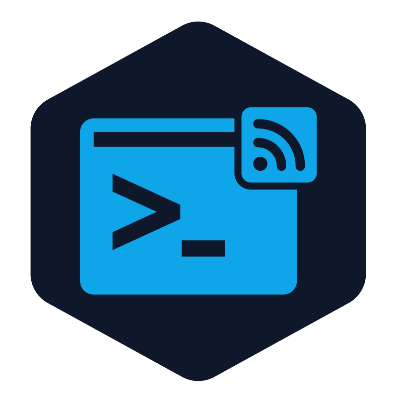

<p align="center">
  <a href="/" target="blank">
    
  </a>
</p>
<h1 align="center">
  <a href="https://npmjs.com/package/nodefeed" target="blank"><strong>nodefeed</strong></a>
</h1>
<p align="center">
  <strong>See what's happening on popular blogging platforms easily from your terminal.</strong>
</p>


- Get articles from popular blogging platforms like Hashnode.
- Filter articles by `latest`, `featured`, `trending` and `user`.
- Data displayed in a beautiful tabular format.

> **Note:-** As of the first release the CLI supports only articles from Hashnode. Future releases will include articles from Dev.to, Medium, etc.

## ⬇ **Installation**

```sh
# This command installs the CLI globally (recommended)
npm install -g nodefeed

# Or run the following command along with the usage. (This will install the CLI everytime you run it)
npx nodefeed <command> <option>
```

## 💻 **Usage**

Basic usage:
```sh
nodefeed <command> <option>
```
> **Commands:**
> - **help** - Print help info 
> - **articles** - Get articles Hashnode

> **Options:**
> - **-c, --clear** - Clear the console on every task.
>  - **-d, --debug** - Print debug info.
>  - **-v, --version** - Print CLI version.
>  - **-l, --latest** - Filter latest articles.
>  - **-f, --featured** - Filter featured articles.
>  - **-u, --user** - Filter articles by user.
>  - **-t, --trending** - Filter trending articles.
>  - **-c, --community** - Filter trending articles.

Example usage:
```sh
# get featured articles
nodefeed articles -f
```

## 🤝 **Contributing**
Please contribute using the [Github Flow](https://guides.github.com/introduction/flow). Create a branch, add commits and [open up a pull request](https://github.com/ammaaraslam/nodefeed/compare). *Make sure your PR isn't a duplicate*
Please also read [`CONTRIBUTING.md`](https://github.com/ammaaraslam/nodefeed/blob/master/CONTRIBUTING.md) and [`CODE_OF_CONDUCT.md`](https://github.com/ammaaraslam/nodefeed/blob/master/CODE_OF_CONDUCT.md)

## ⚙ **Development**
1. Clone the Repository
```sh
git clone https://github.com/ammaaraslam/nodefeed.git
```
2. Move into the working directory
```sh
cd nodefeed
```
3. Install Dependencies
```sh
npm install
```
4. Run the CLI in a local environment. (To view reflected changes)
```sh
# create update of the CLI locally.
npm link

# Use the CLI as usual.
nodefeed <command> <option>
```

## 👨‍💻 **Author**
<strong><h2>Ammaar Aslam</h2></strong>
<p>
<strong>Twitter 🐦</strong> - <a href="https://twitter.com/itsammaar_7" target="_blank">@itsammaar_7</a> <br>
<strong>Instagram 📸</strong> - <a href="https://www.instagram.com/its.ammaar_7" target="_blank">@itsammaar_7</a> <br>
<strong>GitHub 🐱</strong> - <a href="https://github.com/ammaaraslam" target="_blank">@ammaaraslam</a> <br>
<strong>Hashnode 📚</strong> - <a href="https://hashnode.com/@ammaaraslam" target="_blank">@ammaaraslam</a> <br>
</p>

## 🙏 Support

If you found the app helpful, consider supporting me with a coffee.

<a href="https://www.buymeacoffee.com/ammaaraslam" target="_blank">

</a>
